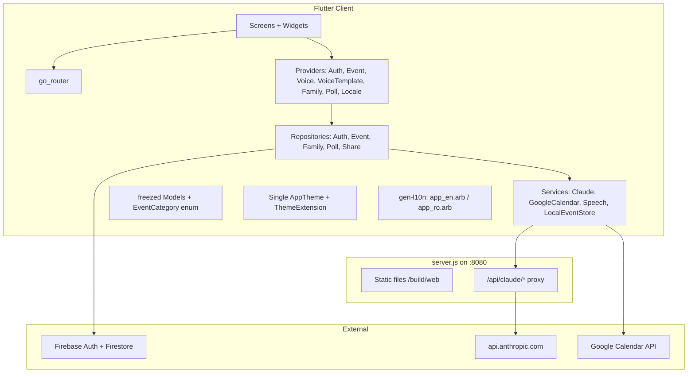

# DayBrief Full Remediation Plan

A concrete 4-phase plan. Every file path is relative to the repo root. Phases are ordered so each one leaves the codebase compiling and runnable.

## Session plan (two chats)

| Session | Scope | When |
|---------|--------|------|
| **Session 1** | **Phase 0 only** — security, broken CRUD, Firebase rules, bundle IDs | Today (this device) |
| **Session 2** | **Phases 1–4** — cleanup, architecture, features, tests/docs | When you paste the continuation prompt below |

Phase 0 should be **committed and pushed** before Session 2 so the Mac (or any machine) starts from the same baseline.

### Session 1 — Phase 0 (today)

```
Read docs/REMEDIATION-PLAN.md, docs/CODE-REVIEW.md, and docs/DECISIONS.md.
Execute Phase 0 only. After each subsection run flutter analyze.
When Phase 0 is complete, summarize what changed and remind me to commit and push.
Do not start Phase 1.
```

### Session 2 — Phases 1–4 (later)

See **`docs/CONTINUE-PHASES.md`** for the copy-paste prompt. Short version:

```
Continue DayBrief remediation.

Read docs/REMEDIATION-PLAN.md, docs/DECISIONS.md, and docs/CODE-REVIEW.md for full context.
Assume Phase 0 is complete — verify with git log and flutter analyze before starting.

Execute Phases 1, 2, 3, and 4 in order from docs/REMEDIATION-PLAN.md.
After each phase: run flutter analyze, fix issues, then commit with a message like "refactor: Phase N …".
Do not skip subsections unless blocked — if blocked, say what and stop.
Push when I ask.
```

## Target architecture (end state)



---

## Phase 0 — Stop the bleeding (security + broken production paths)

Goal: app is safe to demo and core flows work. Leaves codebase compiling at every step. **~1 day of work.**

### 0.1 Claude API proxy (server.js + claude_service.dart)

Domain endpoints, zero new npm deps, key stays server-side.

**Extend `server.js`:** add `/api/claude/*` POST handler before the static branch. Use `https.request` to forward to `https://api.anthropic.com/v1/messages`. Headers: `x-api-key: process.env.ANTHROPIC_API_KEY`, `anthropic-version: 2023-06-01`. Fail fast at boot if `ANTHROPIC_API_KEY` is missing. Forward `retry-after` + `anthropic-ratelimit-*` headers back to the client.

Endpoints (server builds the prompt templates currently inlined in `lib/services/claude_service.dart`):
- `POST /api/claude/parse-event` — body `{userText, userId}` → `{success, event?, error?}`
- `POST /api/claude/daily-summary` — body `{events:[{title,dateTime,description?}]}` → `{success, text?}` (server-side empty-events short-circuit preserved)
- `POST /api/claude/answer-question` — body `{question, events:[...]}` → `{success, text?}`
- `POST /api/claude/smart-suggestions` — body `{events:[...]}` → `{success, text?}` (server-side `<3` short-circuit)

**Rewrite `lib/services/claude_service.dart`:** drop `AppConfig.anthropicApiKey`. Switch to relative URLs (`/api/claude/*`) — same-origin on the production `node server.js` path. Convert to an injectable instance class with an injected `http.Client` (still ~30 LOC, no behavior change).

**Update `lib/config/app_config.dart` template** and `SETUP.md` Step 3: remove the `anthropicApiKey` field; document setting `ANTHROPIC_API_KEY` env var before `node server.js`. **Rotate the existing API key** (current one is in git history of any laptop that ever generated `app_config.dart`).

**Mobile guard (v1, web-only):** in `lib/widgets/add_event_sheet.dart:212-284` (AI Quick Add section) and `lib/screens/home_screen.dart:107-189` (`_showAISummary`), gate UI behind `kIsWeb`. Mobile gets a "Web only" tooltip on the sparkle button. Deferred: hosted-proxy story for mobile.

### 0.2 Auth navigation — drop `pushReplacement`

In `lib/screens/auth_screen.dart:54-65`, delete the entire `Navigator.of(context).pushReplacement(MaterialPageRoute(builder: (_) => const HomeScreen(...)))` block. The `Consumer<AuthProvider>` in `lib/main.dart:129-145` already routes; success just needs to set auth state and return. This restores `onThemeChanged` + `onCategoryColorsChanged` for email sign-in users.

### 0.3 Month view broken CRUD

In `lib/screens/month_view_screen.dart`:
- L7: change `import '../widgets/add_event_sheet_demo.dart';` → `import '../widgets/add_event_sheet.dart';`
- L222: replace `onDelete: () {}` → `onDelete: () => context.read<EventProvider>().deleteEvent(selectedDayEvents[index].id)` and add `categoryColors: widget.categoryColors ?? {}`
- L232-238: replace `AddEventSheetDemo(onEventAdded: widget.onAddEvent, ...)` → `AddEventSheet(initialDate: _selectedDay)`

### 0.4 Register `VoiceTemplateProvider`

In `lib/main.dart:101-106` `MultiProvider`, add `ChangeNotifierProvider(create: (_) => VoiceTemplateProvider())`.

### 0.5 Bundle ID alignment → `com.daybrief.app`

Unifies platform IDs so Firebase Auth/OAuth works everywhere:

- `android/app/build.gradle` — already correct (`namespace`/`applicationId`)
- `android/app/src/main/kotlin/com/voiscal/voice_cal/MainActivity.kt` — move file to `com/daybrief/app/MainActivity.kt`, update `package` declaration
- `ios/Runner.xcodeproj/project.pbxproj` — replace `com.voiscal.voiceCal` with `com.daybrief.app` at L371, L550, L572 (and tests at L387, L404, L419)
- `ios/Runner/Info.plist` — `CFBundleDisplayName: DayBrief`, `CFBundleName: day_brief`
- `macos/Runner/Configs/AppInfo.xcconfig:11` — `PRODUCT_BUNDLE_IDENTIFIER = com.daybrief.app`
- `linux/CMakeLists.txt:10` — `APPLICATION_ID = com.daybrief.app`
- `web/manifest.json` — `name`/`short_name`: `DayBrief`
- `lib/firebase_options.dart` L55, L64 — `iosBundleId: 'com.daybrief.app'`
- Re-run **FlutterFire CLI** (`flutterfire configure`) against the real `daybrief-d6bf6` project to regenerate `firebase_options.dart` and the real `android/app/google-services.json` (current one is a `daybrief-placeholder` dummy)

### 0.6 Firestore rules + indexes (initial)

Create at repo root:
- `firebase.json` — pointer to rules + indexes
- `.firebaserc` — `"default": "daybrief-d6bf6"`
- `firestore.rules` — start with: `events/{id}` allow read/write if `request.auth.uid == resource.data.userId`; `users/{uid}` allow read/write if `request.auth.uid == uid`
- `firestore.indexes.json` — composite index `events` on `userId ASC, dateTime ASC`

---

## Phase 1 — Delete and consolidate

Goal: remove duplication. Each deletion is verified zero-reference from the dead-code research. **~0.5 day of work.**

### 1.1 Safe immediate deletes (zero refs across `lib/`)

- `lib/screens/home_page.dart`
- `lib/screens/week_view_screen_demo.dart`
- `lib/widgets/events_list_widget.dart`
- `lib/widgets/event_categories.dart`
- `lib/services/firebase_service.dart`
- `lib/main_firebase.dart`
- `lib/main_demo.dart`
- `lib/theme/theme.dart` — kept palette is merged into the new `AppTheme` (1.3)

### 1.2 Port AddEventSheet feature-parity, then delete demo

The demo has features the prod sheet lacks. Port to `lib/widgets/add_event_sheet.dart`:
- Category picker block (horizontal chips) — from `add_event_sheet_demo.dart:160-179`
- Location field + pass to `Event` constructor
- Reminder switch UI — wires `Event.reminderEnabled`
- Quick-time chips (Morning/Afternoon/Evening/Night)
- Replace hardcoded `Color(0xFFFAFAFA)` field fills with theme tokens (lines 296, 321, 343, 367)

Then delete `lib/widgets/add_event_sheet_demo.dart`.

### 1.3 Single `AppTheme` — keep `app_theme.dart` palette, delete `theme.dart`

Decision: keep the brown/earth-tone palette in `lib/theme/app_theme.dart` (more cohesive than the peach palette). Add a `ThemeExtension` for user-customizable category colors so settings can still override them without rebuilding `MaterialApp`:

```dart
class CategoryColors extends ThemeExtension<CategoryColors> {
 final Map<EventCategory, Color> values;
 const CategoryColors(this.values);
 @override CategoryColors copyWith({Map<EventCategory, Color>? values}) => ...;
 @override CategoryColors lerp(ThemeExtension<CategoryColors>? other, double t) => ...;
}
```

In `lib/main.dart`: delete the inline `_buildTheme()` (L153-209) and the inline category map (L44-50). Wire `theme: AppTheme.lightTheme.copyWith(extensions: [CategoryColors(...)])`. Persist user-customized category colors via SharedPreferences as today, but reach them via `Theme.of(context).extension<CategoryColors>()`.

**Delete the 10 duplicate category-color maps** (replace each with `Theme.of(context).extension<CategoryColors>()!.values[category]`):
- `lib/screens/auth_screen.dart:57-63`
- `lib/screens/settings_screen.dart:40-46`
- `lib/widgets/event_card.dart:23-29`
- `lib/screens/time_report_screen.dart:28-35`
- `lib/screens/share_calendar_screen.dart:151-159` (switch)
- `lib/screens/voice_templates_screen.dart:153-167` (switch)

### 1.4 Voice command consolidation — keep `VoiceCommandService`

`VoiceCommandService` (271 LOC, currently orphaned) is the most capable parser. Keep it as the single router.

- **Delete** `EventProvider.parseVoiceEvent` (L189-207) and `EventProvider.formatEventsForSpeech` (L179-187) — move TTS formatting to `VoiceCommandService` or a small `VoiceCommandFormatter`.
- **Delete** the inline regex parser in `lib/widgets/voice_assistant_button.dart:73-100`.
- **Wire** `VoiceCommandService` into `VoiceProvider`. Replace the TTS side-channel (`MOVE_EVENT:...`, `DELETE_EVENT:...`, `SHOW_ADD_EVENT`) with a proper sealed return type `VoiceAction { showAddEvent; moveEvent(id, time); deleteEvent(name); spoken(text); }`. Caller intercepts and dispatches.
- **Integrate** `VoiceTemplateProvider.matchTemplate(text)` at the top of `processCommand` — template hit short-circuits to `addEvent`.

---

## Phase 2 — Architectural backbone

Goal: make the code testable and reasonable. Everything below is foundational for Phase 3 features. **~2–3 days of work.**

### 2.1 Models → `freezed` + `EventCategory` enum

Add to `pubspec.yaml` (dev + runtime):
- `freezed_annotation`, `json_annotation` (deps)
- `freezed`, `json_serializable`, `build_runner` (dev_deps)

Migrate `lib/models/event.dart`:
- Introduce `enum EventCategory { work, personal, health, social, shopping, other }` with `String name` for JSON serialization (not `.index` — fixes the reorder-crash bug at L56)
- `@freezed class Event with _$Event` — `==`/`hashCode`/`copyWith`/`toJson`/`fromJson` all generated
- Custom `_parseDateTime(dynamic)` that handles `String`, Firestore `Timestamp`, and `DateTime` (fixes crash at L49)
- Validation: throw `FormatException` if `title`/`userId` missing instead of empty-string default (L47)

Migrate `lib/models/voice_template.dart`:
- Same `freezed` treatment
- Move 58-line `defaultTemplates` seed (L58-115) to `lib/models/voice_template_defaults.dart`
- Parse `defaultTime` string into `TimeOfDay` at construction

Replace all `'Work'`/`'Personal'`/etc. string literals (the category-color audit lists every site) with `EventCategory.work` etc. Switch sites become `switch` exhaustive.

Update 12 `Event(` constructor callsites.

### 2.2 Repository layer + dependency injection

New files (skinny abstractions over current services):
- `lib/repositories/auth_repository.dart` — wraps `FirebaseAuth`
- `lib/repositories/event_repository.dart` — wraps Firestore + `LocalEventStore` (chooses based on auth state)
- `lib/repositories/voice_template_repository.dart` — wraps SharedPreferences
- `lib/repositories/family_repository.dart` — new (Phase 3 backend)
- `lib/repositories/poll_repository.dart` — new (Phase 3 backend)
- `lib/repositories/share_calendar_repository.dart` — new (Phase 3 backend)

Refactor all 4 providers to accept repositories via constructor (no more `FirebaseAuth.instance` inside provider). Wire in `MultiProvider` via `Provider` for repos + `ChangeNotifierProxyProvider` for providers that depend on `AuthRepository`.

**Eliminates duplicate auth listener** in `lib/providers/event_provider.dart:28-35`: `EventProvider` becomes a `ChangeNotifierProxyProvider2<AuthRepository, EventRepository, EventProvider>` that reacts to auth state from the single source.

### 2.3 Provider lifecycle fixes

- `lib/providers/auth_provider.dart:16-19`: store `StreamSubscription` in field, cancel in new `@override dispose()`
- `lib/providers/event_provider.dart:28-35`: same fix for auth subscription
- `lib/providers/event_provider.dart` sign-out path: synchronously `_events = []; notifyListeners();` **before** `_loadLocalEvents()` (fixes stale-data flash)
- `lib/providers/voice_provider.dart:72-74`: add `@override` and `super.dispose()`
- All mutable list getters → `List.unmodifiable(_events)` and `List.unmodifiable(_templates)`

### 2.4 `AsyncValue<T>` for provider state

Replace ad-hoc `bool isLoading + String? error` everywhere with a small sealed class in `lib/utils/async_value.dart`:

```dart
sealed class AsyncValue<T> { const AsyncValue(); }
class AsyncIdle<T> extends AsyncValue<T> { const AsyncIdle(); }
class AsyncLoading<T> extends AsyncValue<T> { const AsyncLoading(); }
class AsyncData<T> extends AsyncValue<T> { final T value; const AsyncData(this.value); }
class AsyncError<T> extends AsyncValue<T> { final Object error; final StackTrace? st; const AsyncError(this.error, [this.st]); }
```

UI uses `switch` on the state. Surfaces errors uniformly (currently `EventProvider.error` is set but never shown).

### 2.5 go_router migration

Add `go_router` to `pubspec.yaml`. Create `lib/router/app_router.dart`:

- `/auth` → `AuthScreen`
- `ShellRoute` wrapping `/home`, `/week`, `/month` in an `IndexedStack` (fixes the view-selector bug at `lib/screens/home_screen.dart:191-200` — Day/Week/Month switch via `context.go` without push/pop drift)
- `/search`, `/settings`, `/driving`, `/calendar-sync`, `/voice-templates`, `/family`, `/share`, `/poll/:pollId?`, `/time-report`
- `redirect:` enforces auth gate (replaces the `Consumer<AuthProvider>` in `main.dart`)

Delete every `Navigator.push(MaterialPageRoute(...))` (13 sites). Settings `Navigator.pop(context)` → `Navigator.push(...)` anti-pattern at L150-184 becomes `context.go(...)`.

Drop dead constructor params: `TimeReportScreen.events` (ignored), `ShareCalendarScreen.events`, `FamilyCalendarScreen.onAddEvent`, `MonthViewScreen.events` — screens read from `EventProvider` directly.

---

## Phase 3 — Feature completion

Goal: orphan screens and stub screens become real features. Each gets a settings entry and a real backend. **~2–3 days of work.**

### 3.1 Wire `CalendarSyncScreen`

- Refactor `lib/screens/calendar_sync_screen.dart` to drop constructor params; read events from `EventProvider`; import callback becomes a direct `eventProvider.addEvent` loop
- Add nav entry in new "Calendar & Sync" section in `lib/screens/settings_screen.dart` (between Notifications and Analytics)
- Remove unused `url_launcher` import at L4

### 3.2 Wire `VoiceTemplatesScreen`

- Add nav entry as **first row** in the existing "Voice Assistant" section in `lib/screens/settings_screen.dart`
- Add an edit flow (currently only add + delete; `updateTemplate` exists unused)
- Use UUID (`package:uuid`) for IDs instead of `millisecondsSinceEpoch` (collision risk at L259)

### 3.3 Complete `FamilyCalendarScreen` with real backend

Firestore schema:
- `families/{familyId}` — `{name, ownerId, createdAt, inviteCode}`
- `families/{familyId}/members/{uid}` — `{displayName, avatar, color, role, joinedAt}`
- `families/{familyId}/events/{eventId}` — `{title, dateTime, description?, category?, createdBy, reminderEnabled}`

New: `lib/providers/family_provider.dart` + `lib/repositories/family_repository.dart` with: `createFamily`, `joinFamily(inviteCode)`, `inviteMember(email)`, `watchFamilyEvents`, `addFamilyEvent`, `removeFamilyEvent`.

Refactor `lib/screens/family_calendar_screen.dart`: delete hardcoded `_familyMembers` (L15-19) and `_familyEvents` (L21-25); wire to `FamilyProvider`. Implement the "Send Invite" button (L182) and the add-event handler (L255-262).

Firestore rules: read/write requires `families/{id}/members/{uid}` doc existence.

### 3.4 Complete `ShareCalendarScreen` with real backend

Firestore schema:
- `share_codes/{code}` — `{ownerId, createdAt, expiresAt?, isActive, eventFilter}`

New: `lib/services/share_calendar_service.dart` + `lib/repositories/share_calendar_repository.dart` — `createShareCode(ownerId, ttl?)`, `revokeShareCode(code)`, `watchSharedEvents(code)`.

Refactor `lib/screens/share_calendar_screen.dart:24-32`: replace fake timestamp-base36 code with real Firestore-backed code creation. Add `share_plus` integration (package already in pubspec) for the share button. New screen `SharedCalendarViewScreen` for viewer flow (`/shared/:code`).

### 3.5 Complete `QuickPollScreen` with real backend

Firestore schema:
- `polls/{pollId}` — `{title, createdBy, createdAt, status, shareCode?}`
- `polls/{pollId}/options/{optionId}` — `{time, voteCount}` (denormalized)
- `polls/{pollId}/votes/{voteId}` — `{optionId, voterName, voterId?, votedAt}`

New: `lib/services/poll_service.dart` + `lib/providers/poll_provider.dart` — `createPoll`, `castVote`, `watchPoll(pollId)`, `getPollByShareCode(code)`.

Refactor `lib/screens/quick_poll_screen.dart`: replace in-memory `_options` (L13-17) with `Stream<PollWithResults>`; persist `_titleController` value; add share button to invite voters; `/poll/:pollId` route renders shared poll for participants.

### 3.6 `SpeechService` hardening + iOS Info.plist

In `lib/services/speech_service.dart`:
- Wire `onStatus` callback (L18-19): on `'done'`/`'notListening'`, reset `_isListening = false` and invoke `onListeningStopped`
- Add `finally` block in `startListening` (after L71) to reset `_isListening`
- Request mic permission in `initialize()` using `permission_handler` (already in pubspec): `Permission.microphone.request()`
- Locale-aware: accept `String languageCode` param, set `'ro-RO'` or `'en-US'` based on app locale

Add to `ios/Runner/Info.plist`:
- `NSMicrophoneUsageDescription`: "DayBrief needs microphone access for voice commands and driving mode."
- `NSSpeechRecognitionUsageDescription`: "DayBrief uses speech recognition to understand your schedule commands."

### 3.7 `LocalEventStore` user scoping

Rename `lib/services/database_service.dart` → `lib/services/local_event_store.dart`. Key scheme `daybrief_events_$userId` (anonymous → `daybrief_events_anonymous`, demo → `daybrief_events_demo_user`). Add `setActiveUser(String? userId)` called from `AuthProvider` state changes. One-time migration copies legacy `daybrief_events` → user-scoped key on first read.

Keep SharedPreferences (don't switch to sqflite yet — defer until needed).

### 3.8 `GoogleCalendarService` fixes

In `lib/services/google_calendar_service.dart`:
- L17-20: null-check `signInResult`, return `bool`
- L12: delete `_accessToken` field; fetch `_currentUser!.authHeaders` per request (auto-refreshes)
- L59, L63: timezone — add `flutter_timezone` package; replace hardcoded `'UTC'` with `await FlutterTimezone.getLocalTimezone()`
- L79-81: add `_escapeIcs(String)` helper (RFC 5545: escape `\\`, `\n`, `;`, `,`) and apply to SUMMARY + DESCRIPTION

### 3.9 Settings persistence

Currently 14 of 22 settings rows are UI-only `setState`. Persist via SharedPreferences in a new `SettingsProvider` keyed under `settings_*`. Wire notification toggles to a no-op service for now (real notification scheduling is out of scope). Delete the dead "Smart Shortcuts" toggle at L159 (empty `(value) {}` handler) or implement it.

### 3.10 i18n with gen-l10n + driving mode language fix

Add `flutter_localizations` to `pubspec.yaml`; `flutter: generate: true`. Create `l10n.yaml`, `lib/l10n/app_en.arb`, `lib/l10n/app_ro.arb`.

Extract ~400 strings across 22 UI files. Highest priority files (mixed EN/RO):
- `lib/screens/home_screen.dart` (especially empty state L559-574 + bottom nav labels L630-647)
- `lib/screens/driving_mode_screen.dart` (~32 strings, mixed)

In `lib/services/speech_service.dart:23,90`, set TTS locale dynamically: `ro-RO` when app locale is Romanian. Fix the lone English string at `lib/screens/driving_mode_screen.dart:138`. Fix diacritic at L161 (`Urmatorul` → `Următorul`).

Add Language picker tile in `lib/screens/settings_screen.dart` under Appearance. Persist locale via SharedPreferences. `MaterialApp(locale: ..., localizationsDelegates: ..., supportedLocales: ...)`.

Initialize date formatting for both `'en_US'` and `'ro_RO'` in `main()`. Replace hardcoded `'en_US'` in `lib/screens/home_screen.dart:454-465` with `Localizations.localeOf(context).toString()`.

---

## Phase 4 — Hardening & polish

**~1–2 days of work.**

### 4.1 Accessibility pass

Highlights from the 32-item a11y fix list:
- Wrap `lib/screens/home_screen.dart:342-366` header buttons in `Semantics(button: true, label: ...)`, enforce 48dp min
- `tooltip:` on every `IconButton` in `home_screen`, `week_view_screen`, `month_view_screen`, `auth_screen`, `voice_templates_screen`
- `autofillHints: const [AutofillHints.email/password/givenName/familyName]` in `lib/screens/auth_screen.dart`; wrap fields in `AutofillGroup`; replace `contains('@')` validator with proper regex
- Bottom nav at `lib/screens/home_screen.dart:662-686`: 48dp + `Semantics(selected: isActive, label: ...)`
- Replace hardcoded `fontSize:` literals with `Theme.of(context).textTheme.*` (supports text scaling)

### 4.2 Tests — first wave

Add `mocktail` to dev_deps (no codegen). Create `test/` tree:
- `test/models/event_test.dart` — `fromMap`/`toMap` round-trip, malformed `dateTime`, out-of-range `recurrenceType`, `copyWith` semantics
- `test/services/local_event_store_test.dart` — user scoping isolation + legacy key migration
- `test/services/google_calendar_service_test.dart` — local timezone, ICS escaping round-trip, cancelled sign-in
- `test/services/voice_command_service_test.dart` — wake-word detection, intent routing, move/delete parsing
- `test/providers/event_provider_test.dart` — `getEventsForDay` across midnight boundary
- `test/repositories/auth_repository_test.dart` — sign-in/out happy path with mocked `FirebaseAuth`

Goal: ~30 tests covering the highest-risk units.

### 4.3 Logger + analyzer tightening

Create `lib/utils/logger.dart` — small `dart:developer` wrapper (`DayBriefLog.{debug,info,warning,error}`). Replace all 12 `print()`/`debugPrint()` calls in services and `main.dart`.

Tighten `analysis_options.yaml`:

```yaml
analyzer:
 language:
 strict-casts: true
linter:
 rules:
 avoid_print: true
 prefer_const_constructors: true
 unawaited_futures: true
 use_build_context_synchronously: true
 always_declare_return_types: true
```

### 4.4 Documentation refresh

- Replace `README.md` (currently default Flutter template) with a project overview
- Update `SETUP.md` Step 3 to document `ANTHROPIC_API_KEY` env var instead of `app_config.dart`
- Reconcile `DOCUMENTATION.md` with reality: remove SQLite/mock-auth claims, drop `firebase_service.dart` / `app_theme.dart` from file tree, document `VoiceCommandService` as canonical voice router
- Parameterize hardcoded paths in `create_icons.ps1:3` (`C:\Users\Mircea\Desktop\cal2.0\...`)
- Update `set_java_home.ps1` to use JDK 17 (matches Gradle) instead of JDK 25

---

## Effort estimate (single dev)

**Session 1 (today):** Phase 0 only — ~1 day

**Session 2 (continuation prompt):** Phases 1–4 — ~6–9 days focused

- Phase 1: ~0.5 day (deletions + theme consolidation)
- Phase 2: ~2–3 days (freezed migration + repositories + AsyncValue + go_router)
- Phase 3: ~2–3 days (3 stub screens × backend + service hardening + i18n)
- Phase 4: ~1–2 days (a11y + tests + docs)

**Total: ~7–10 days of focused work** (~11–14 days realistic with testing/debugging buffer). Each phase is independently shippable — could be split across PRs.
